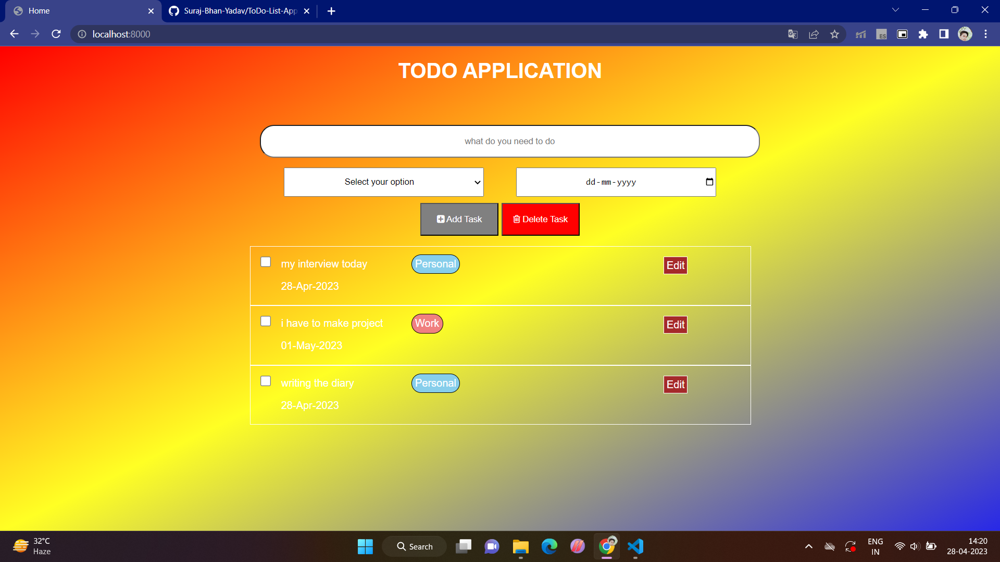
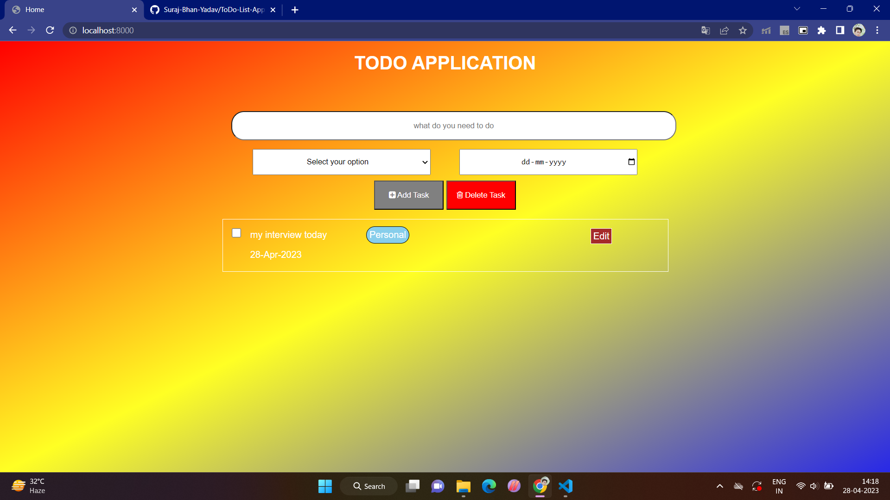

# ToDo_App

## Overview

It is a simple TODO application using NodeJS and MongDB. where a user of this application can create,edit and delete all the ToDo items .

### Screenshot

## My process

ToDo application is based on NodeJs and express as server side technology, MongoDb for Data-Base,and ejs fro front-end.

### Built with

- HTML
- CSS
- JavaScript
- AJAX
- NodeJs
- express
- MongoDB
- ejs

### Useful resources

- [MongoDb](https://mongoosejs.com/)
- [expressJs](https://expressjs.com/)
